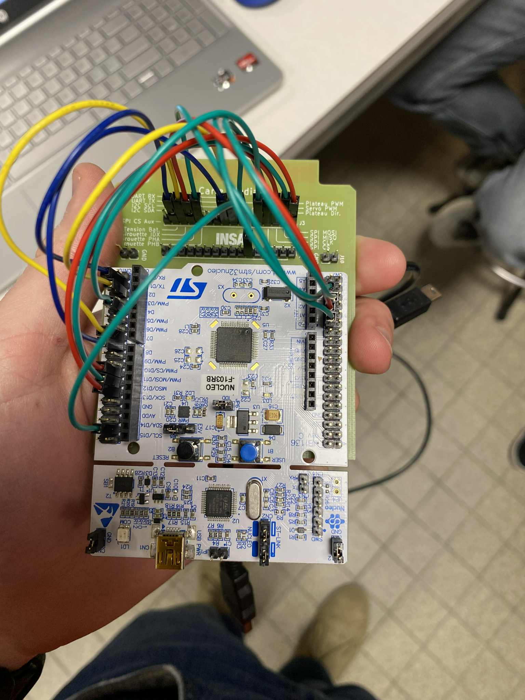

# µcontroleurs 4AE-SE 2025

Bienvenue dans le projet voilier en µcontroleurs 4AE-SE 2025.

Velkommen til seilbåtprosjektet i µkontrollere 4AE-SE 2025.

Bem vindo ao projeto veleiro de µcontroladores 4AE-SE 2025.

Welkom bij het microcontroller zeilbootproject 4AE-SE 2025.

License : CC-BY-NC-SA 4.0

## Les groupes et résponsabilités sont :
>>Nicolas et Jarno : Envoi de UART et PWM dans la bonne fréquence (canal), pour relier le voilier (3.5?) à l'ecran. (3.7)
Ils utilisent les broches PA9 (D8) et PA10 (D2) pour l'USART.

>>Aleksander et Brage : Acceleromètre par I2C (3.2). La chûte du voilier envoie la commande de faire lâcher les voiles.
Ils utilisent les broches PA4, PA5, PA6 et PA7 pour l'acceleromètre. 
PA2 pour la gestion de l'ADC.

>>Oskar et Tiago : Controler les voiles (3.4) avec les données de la girouette (3.1)
Ils utilisent les broches PA0, PA1 et PA8 pour la girouette et les broches PB8  pour controler les voiles.

>>En commun : Géstion de la pile avec l'ADC (3.6) et clock interne avec CMOS. (3.3)

